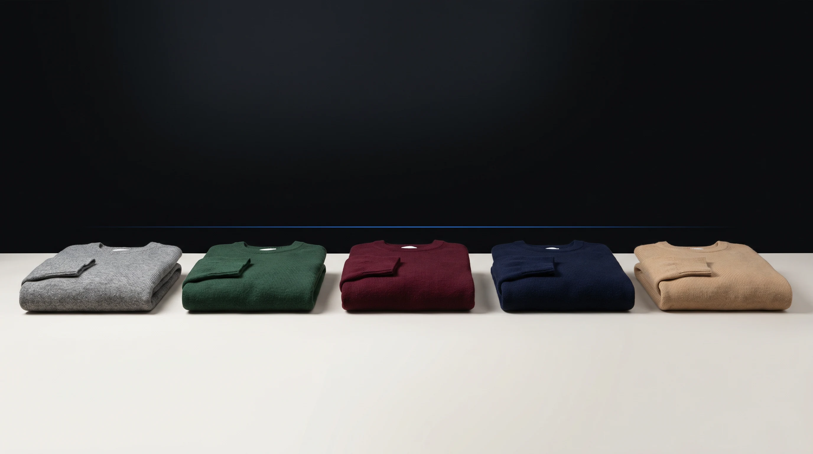

<p align="center">
  
  </br>
  <h3 align="center"><a href="https://on-model.com">Garment Recolor by PiktID</a></h3>
</p>

<p align="center">
  <b>Recolor one garment consistently across a whole set of product images with AI.</b>
  <br/>

</p>

<p align="center">
  
</p>

# Garment Recolor - v1.0
[](https://on-model.com)
[](https://app.on-model.com)
[](https://discord.com/invite/FJU39e9Z4P)

Garment Recolor implementation by PiktID for recoloring a single garment consistently across a set of product images. This script takes several photos of the same garment, recolors the garment toward a reference colour/pattern image and/or a text instruction, and keeps everything else untouched — using the <a href="https://v2.api.piktid.com">PiktID v2 API</a>.

## Why On-Model?

- **Recolor a whole set in one job** — Upload several photos of the same garment and recolor them all toward the same target, so the set stays consistent.
- **Identity-free** — Like Create Packshot, recolor is product-only. No model, no identity step.
- **Reference image, text, or both** — Recolor toward an uploaded colour/pattern swatch, a hex code (e.g. `#2E5A3B`), a plain-language instruction (e.g. "make it forest green"), or any combination.
- **Only the garment changes** — Name the garment (or let it be detected) and everything outside it is preserved.
- **Consistent across the set** — Every output keeps the same recolored look, so a product family reads as one.
- **Batch processing** — Recolor entire catalogs with parallel workers. Scale from 10 SKUs to 10,000.
- **Full API access** — Automate recoloring in your existing workflow, PIM system, or custom pipeline.
- **4K output** — Production-ready resolution for web, print, and advertising.

Built by PiktID — the team behind [Studio](https://studio.piktid.com) and EraseID, used by 300,000+ people for AI-powered image processing.

## About On-Model

[On-Model](https://on-model.com) is an AI-powered platform by PiktID designed for fashion e-commerce. It enables brands, retailers, and marketplaces to transform their product imagery at scale:

- **Garment Recolor** — Recolor one garment consistently across a set of product images (this repo)
- **Create Packshot** — Generate clean product packshots from raw garment photos
- **Flat-to-Model** — Convert flat-lay product photography into realistic on-model images
- **Model Swap** — Replace models in existing product photos while preserving garments exactly as they are
- **Identity Management** — Create and maintain consistent AI model identities across your entire catalog

Try the platform at [app.on-model.com](https://app.on-model.com) — **15 free images per month**, no credit card required.

## Getting Started

The following instructions suppose you have already installed a recent version of Python. For a general overview, please visit the <a href="https://docs.piktid.com/docs/v2/garment-recolor">API documentation</a>.

> **Step 0** - Register at <a href="https://app.on-model.com">app.on-model.com</a>. 15 images are given for free to all new users every month. Then generate an API token from your [profile dashboard](https://app.on-model.com/profile?tab=tokens).

> **Step 1** - Clone the Garment Recolor repository
```bash
# Installation commands
$ git clone https://github.com/piktid/garment-recolor.git
$ cd garment-recolor
$ pip install requests
```

> **Step 2** - Prepare your garment folder with images

Place your product images (JPG, JPEG, or PNG format) in a folder. Garment Recolor accepts **1 to 10 photos** per job. For a consistent result, all images should feature the **same** garment — different poses, angles, or models are fine. If you want to recolor toward a reference image (a colour swatch or a patterned fabric), keep it handy too — you'll pass it with `--reference-image`.

> **Step 3** - Run a recolor job

Recolor toward a plain-language instruction:

```bash
$ python garment_recolor.py \
  --input-folder garments/TEE123 \
  --token YOUR_API_TOKEN \
  --garment-label "t-shirt" \
  --instruction "make it forest green" \
  --output-folder results/TEE123
```

Or recolor toward a reference colour/pattern image:

```bash
$ python garment_recolor.py \
  --input-folder garments/TEE123 \
  --token YOUR_API_TOKEN \
  --garment-label "t-shirt" \
  --reference-image swatches/forest-green.jpg \
  --output-folder results/TEE123
```

> **Step 4** - Monitor the processing

The script will automatically:
1. Authenticate with the API
2. Upload all product images from the input folder
3. Create a project (or reuse an existing one)
4. Upload the colour/pattern reference image (if provided)
5. Create a garment-recolor job
6. Monitor job progress
7. Download results to the output folder

You'll see progress updates in the console. Once complete, the recolored images will be saved to your output folder.

> **Step 5** - Review results

Results are saved to the output folder with the following structure:
```
output/
├── output_0_0_v0.jpg     # First image, first variation
├── output_0_1_v0.jpg     # First image, second variation
├── output_1_0_v0.jpg     # Second image, first variation
└── metadata.json         # Complete job information and results
```

The `metadata.json` file contains:
- Job ID and status
- Processing results for each output
- Quality scores and processing times
- Image URLs and metadata

## API Flow

The script follows this sequence of API calls:

All requests are authenticated with a Bearer token (generated from your [profile dashboard](https://app.on-model.com/profile?tab=tokens)) in the `Authorization` header.

```
1. POST /upload             -> Get pre-signed S3 URL + file_id (per image)
2. PUT  <upload_url>        -> Upload image binary to S3
3. POST /project            -> Create project (get project_id)
4. POST /garment-recolor    -> Submit job with project_id + file_ids + recolor target
5. GET  /jobs/<id>/status   -> Poll until status = "completed"
6. GET  /jobs/<id>/results  -> Fetch output images (CloudFront URLs)
```

**No identity step.** Like create-packshot, garment-recolor does not require an identity (outputs are product-only). If you pass `--reference-image`, it is uploaded the same way as your product images (steps 1-2) and its `file_id` is sent as the recolor target. Step 4 sends ALL uploaded product-image UUIDs together; every input image is recolored, producing `len(images) × num_variations` outputs.

**Credit cost:** 3 credits per output at `1024`, 5 at `2048`, 10 at `4096`.

## Recolor target

A job needs to know **which** garment to recolor and **what** to recolor it to.

- **Which garment** — `--garment-label` (e.g. `"t-shirt"`, `"jacket"`, `"hat"`). Optional; auto-detected when omitted.
- **What colour/pattern** — provide **at least one** of:
  - `--reference-image` — a path to a colour/pattern reference image (uploaded like any other image).
  - `--reference-text` — a colour or pattern as text, e.g. a hex code `#2E5A3B` or a name like `"forest green"`.
  - `--instruction` — a free-form recolor instruction, e.g. `"make it forest green"`.

These can be combined — for example, a reference image to set the colour and an instruction to refine it.

| Field | Type | Description |
|-------|------|-------------|
| `garment_label` | string | Which garment to recolor. Auto-detected when omitted. |
| `reference_image` | string | File ID of a colour/pattern reference image to recolor toward. |
| `reference_text` | string | A colour or pattern as text (hex code or name). |
| `instruction` | string | Free-form recolor instruction. |
| `num_variations` | int (1-8) | Number of output variations per input image. |
| `processing_size` | int | Output resolution: `1024`, `2048`, or `4096`. Drives credit cost (3 / 5 / 10 per output). |

## Consistency across the set

Garment Recolor is built to recolor a whole set the same way. Two options keep the outputs cohesive, and **both are on by default**:

- **`use_anchor`** — keeps the recolored garment visually consistent and cohesive across every output in the set. Pass `--no-use-anchor` to turn it off and recolor each image independently. Only has an effect when the job produces more than one output.
- **`post_process`** — a finishing pass that keeps the recolored garment tones consistent across the set. Pass `--no-post-process` to skip it.

Leave both on for catalog-style sets where the colour must match across images; turn them off if you want each image handled in isolation.

## Command Line Options

```
--input-folder        Path to folder containing product images (required)
--token               API token (required) — generate at https://app.on-model.com/profile?tab=tokens
--output-folder       Output folder for results (default: output)
--base-url            API base URL (default: https://v2.api.piktid.com)
```

**Recolor target (at least one of the colour options is required):**
```
--garment-label       Which garment to recolor, e.g. "t-shirt" (auto-detected if omitted)
--reference-image     Path to a colour/pattern reference image
--reference-text      Colour or pattern as text, e.g. "#2E5A3B" or "forest green"
--instruction         Free-form recolor instruction, e.g. "make it forest green"
```

**Output options:**
```
--num-variations      Number of output variations per input image (1-8, default: 1)
--processing-size     Output resolution: 1024 | 2048 | 4096 (default: 2048)
```

**Generation options:**
```
--model               Generation engine: auto | nano_banana_2 | nano_banana_pro | seedream | gpt_image (default: auto)
--no-use-anchor       Disable cross-output consistency (on by default)
--no-post-process     Disable the finishing pass (on by default)
--add-ai-watermark    Bake an "AI-generated" disclosure mark into each output (irreversible)
```

## Advanced: choosing a generation model

By default, On-Model picks the best generation engine for you (`--model auto`). The default engine runs with a safety fallback if the primary engine refuses the content. You can also force a specific engine:

```bash
$ python garment_recolor.py \
  --input-folder garments/TEE123 \
  --token YOUR_API_TOKEN \
  --instruction "make it forest green" \
  --model nano_banana_pro
```

Accepted values: `auto` (default), `nano_banana_2`, `nano_banana_pro`, `seedream`, `gpt_image`. Forcing a specific engine disables the safety fallback — if that engine refuses the content, the job fails instead of switching engines.

Each entry in the job results response carries a `model_used` field indicating which engine actually produced that image. The script prints it next to each downloaded file (e.g. `Downloaded: output_0_0_v0.jpg (model: nano_banana_pro)`) and the raw value is preserved in `metadata.json`.

## Advanced: resolution and cost

`--processing-size` sets the output resolution and drives the credit cost per output:

| Processing size | Resolution | Credits per output |
|-----------------|------------|--------------------|
| `1024` | 1K | 3 |
| `2048` (default) | 2K | 5 |
| `4096` | 4K | 10 |

Total credits for a job = outputs × per-output cost, where outputs = `len(images) × num_variations`. Larger sizes cost more and take longer.

## Usage Examples

### Example 1: Recolor toward a text colour

```bash
$ python garment_recolor.py \
  --input-folder garments/TEE123 \
  --token YOUR_API_TOKEN \
  --garment-label "t-shirt" \
  --reference-text "#2E5A3B" \
  --output-folder output/TEE123
```

### Example 2: Recolor toward a reference image

```bash
$ python garment_recolor.py \
  --input-folder garments/TEE123 \
  --token YOUR_API_TOKEN \
  --garment-label "t-shirt" \
  --reference-image swatches/forest-green.jpg \
  --output-folder output/TEE123
```

### Example 3: Two variations per image at 4K

```bash
$ python garment_recolor.py \
  --input-folder garments/TEE123 \
  --token YOUR_API_TOKEN \
  --instruction "make it burgundy with a subtle herringbone weave" \
  --num-variations 2 \
  --processing-size 4096
```

### Example 4: Recolor each image independently

Turn off cross-output consistency when you don't need a matching set:

```bash
$ python garment_recolor.py \
  --input-folder garments/TEE123 \
  --token YOUR_API_TOKEN \
  --instruction "make it forest green" \
  --no-use-anchor
```

## Batch Processing (Parallel)

For recoloring multiple garment folders at once, use `batch_garment_recolor.py`. It runs multiple `GarmentRecolor` instances in parallel using a thread pool, with each worker handling a complete independent workflow. Each subfolder is one garment set and becomes one job.

### Process all subfolders in a directory

```bash
$ python batch_garment_recolor.py \
  --input-dir garments/ \
  --token YOUR_API_TOKEN \
  --instruction "make it forest green" \
  --output-dir results/
```

This scans `garments/` for subfolders and processes each one as a separate job. Results are saved to `results/<folder-name>/`.

### Process specific folders toward a reference image

```bash
$ python batch_garment_recolor.py \
  --input-folders garments/TEE1 garments/TEE2 garments/TEE3 \
  --token YOUR_API_TOKEN \
  --reference-image swatches/forest-green.jpg \
  --garment-label "t-shirt" \
  --output-dir results/ \
  --parallel 5
```

The same recolor target (`--reference-image` / `--reference-text` / `--instruction` and `--garment-label`) is applied to every garment folder in the batch.

### Batch Command Line Options

```
--input-dir           Directory containing garment subfolders (mutually exclusive with --input-folders)
--input-folders       Specific garment folder paths to process (mutually exclusive with --input-dir)
--token               API token (required) — generate at https://app.on-model.com/profile?tab=tokens
--output-dir          Base output directory (default: output)
--base-url            API base URL (default: https://v2.api.piktid.com)
--parallel            Number of parallel workers (default: 3, max: 5)
```

All recolor-target, output, and generation flags (`--garment-label`, `--reference-image`, `--instruction`, `--num-variations`, `--processing-size`, `--model`, etc.) are also supported and passed through to each worker.

Parallelism is capped at 5 to respect the API rate limit (5 requests/minute on `/garment-recolor`). The built-in retry mechanism handles any 429 responses that occur when jobs are submitted close together.

A JSON summary file is saved to the output directory after each batch run with timing and success/failure details for every folder.

## Rate Limiting and Resilience

The script includes built-in handling for API rate limits:

- **Rate limiting (429):** All API calls automatically retry with exponential backoff (1s, 2s, 4s, 8s, 16s) plus random jitter, up to 5 retries per request
- **Token expiry (401):** If your token has expired, the script will print an error. Generate a new token at [app.on-model.com/profile?tab=tokens](https://app.on-model.com/profile?tab=tokens).

The `/garment-recolor` endpoint is rate-limited to **5 requests per minute** and accounts have a concurrent-job cap (5 active jobs for non-enterprise plans, pooled with garment-recolor, create-packshot, flat-to-model, and model-swap). The retry mechanism handles 429s transparently.

## Troubleshooting

### Authentication Failed
```
Token expired or invalid
```
**Solution:** Generate a new API token at [app.on-model.com/profile?tab=tokens](https://app.on-model.com/profile?tab=tokens). Tokens can be set to expire up to 4 years from issuance.

### No Recolor Target
```
Provide at least one recolor target: --reference-image, --reference-text, or --instruction
```
**Solution:** A recolor job needs something to colour toward. Pass at least one of `--reference-image`, `--reference-text`, or `--instruction`.

### No Images Found
```
No images found in garments/TEE123
```
**Solution:**
- Verify the input folder path is correct
- Check that the folder contains image files (JPG, JPEG, PNG)

### Too Many Images
```
Warning: found 15 images; garment-recolor accepts max 10. Truncating to first 10.
```
**Solution:** garment-recolor accepts a maximum of 10 images per job. Split your inputs into multiple folders (and use the batch processor) or trim the folder to the 10 most representative shots.

### Garment Not Found In An Image
```
Image 2 failed: We couldn't find the t-shirt in this image
```
**Solution:** The named garment wasn't detected in that image. Make sure every image in the folder shows the same garment, or adjust `--garment-label` to better match what's in frame. Only that image fails; the rest of the set still processes.

### Insufficient Credits
```
Failed to create job: 402
Response: {"error": "Insufficient credits", "required_credits": 30.0, ...}
```
**Solution:** Top up your account at [app.on-model.com](https://app.on-model.com) or reduce the `--processing-size` / `--num-variations` of your job. Pricing is 3/5/10 credits per output at 1K/2K/4K.

### Rate Limited
```
Rate limited (429). Waiting 2.1s before retry 1/5...
```
This is normal behavior. The script automatically retries with increasing delays. If you see "Max retries exceeded", wait a minute and try again.

### Job Timeout
```
Timeout: Job took longer than 1200 seconds
```
**Solution:** The job may be taking longer than expected. Check the API server status. You can modify the `max_wait_time` parameter in the `wait_for_job` method if needed.

### Connection Errors
```
Authentication error: Connection refused
```
**Solution:**
- Verify the API server is running
- Check the `--base-url` is correct
- Ensure network connectivity to the API server

## Error Handling

The script will exit with an error code if:
- Authentication fails
- No images are found in the input folder
- No recolor target is provided
- The reference image cannot be uploaded
- Job creation fails (including insufficient credits or an unsupported model)
- Job does not complete successfully
- Results download fails
- Rate limit retries are exhausted

Check the console output for detailed error messages.

## Links

- [On-Model Website](https://on-model.com) — Learn about the platform
- [On-Model App](https://app.on-model.com) — Try the app (15 free images/month)
- [Garment Recolor API docs](https://docs.piktid.com/docs/v2/garment-recolor) — Full API reference for this endpoint
- [Create Packshot Repo](https://github.com/piktid/create-packshot) — Sister repo for clean product packshots
- [Flat-to-Model Repo](https://github.com/piktid/flat-to-model) — Sister repo for flat-lay-to-on-model generation
- [Model Swap Repo](https://github.com/piktid/model-swap) — Sister repo for model swap
- [Create Identity Repo](https://github.com/piktid/create-identity) — Generate proprietary AI models from a brief or a reference image
- [API Documentation](https://docs.piktid.com/docs/v2) — Full API reference
- [PiktID](https://piktid.com) — Company website
- [Discord](https://discord.com/invite/FJU39e9Z4P) — Community and support

## Contact
office@piktid.com
